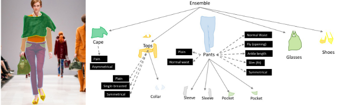

# What we aim to solve

The Problem statement is to come with a innovative approach to identify and analyze trends that are out through various sources across India. This can be trends related to the film industry, seasonal time frames, events, sports etc.

After proper Identification of such trends, finding innovative ways of suitably incorporating the trends into relevant fashion-related flows like designing and merchandising is to be devised.

## Approach

### Trend identification for content:

- Social media and search engine sources like **Instagram, Twitter**, and **Google** are the most common platforms for starting trends.
- We aim to use the developer APIs of all such different internet entities to start mining for the *'hottest'* topics which indicate an uprising tends.
- With the identification and a Sentiment Analysis of the identified topic at hand, the last step would be coming up with insightful taglines or general content about the trendy topic.
- We can use the identified dialogues/meme punch lines etc., as T-Shirt ideas.
- Lastly, we would curate a list of key social media influencers for better marketing.

### Segment scraped images to find minute trends

- A computer vision model that can identify and classify different articles of clothing as well as most design aspects like clothing patterns, designs, materials, color combinations etc. will be developed.

- Running a model like this on pictures posted on social media by film celebrities, YouTubers, sportspeople, etc would help identify the prevalent micro trends in styles of clothing.

- A dashboard would help convey the most popular color combinations, patterns etc. Thus helping designers come up with ideas themselves.

  

OR

**WHY DESIGN YOURSELVES WHEN YOU COULD USE:**

### GAN (Generative adversarial networks)

Gan can help generate different designs of clothing taking into account the current micro-trends from the previous step. The idea is to train a model such that it will be able to generate close to human designs for current micro trends.

## Contributing to existing industry standards

Contribution to existing industry standard:

- Keeping up with the trends followed by the country is a must to keep business flowing.
- Our solution would firstly, help to identify those topics quickly. For example, the IPL in India holds a very positive sentiment across the nation. More specifically, identifying a particular team's/player's positive sentiment and coming with an interesting tagline/design for them would surely be a quick seller and would cut down on huge time and human capital.
- Secondly, identifying the trends in the clothing of internet celebrities and providing insightful statistics would help modern day designers come up with more designs and a wider range of products ultimately boost sales for the company. For example, if a picture of Hrithik Roshan wearing a unique style of clothing got famous amongst others then a proper identification of details would help designers come up with more ideas/designs like that.